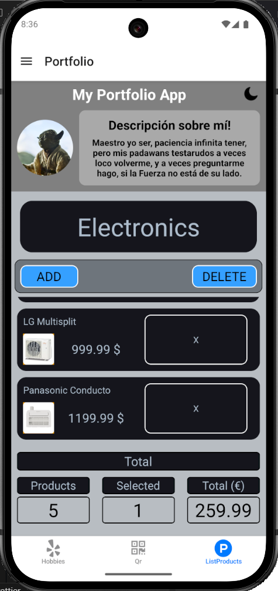
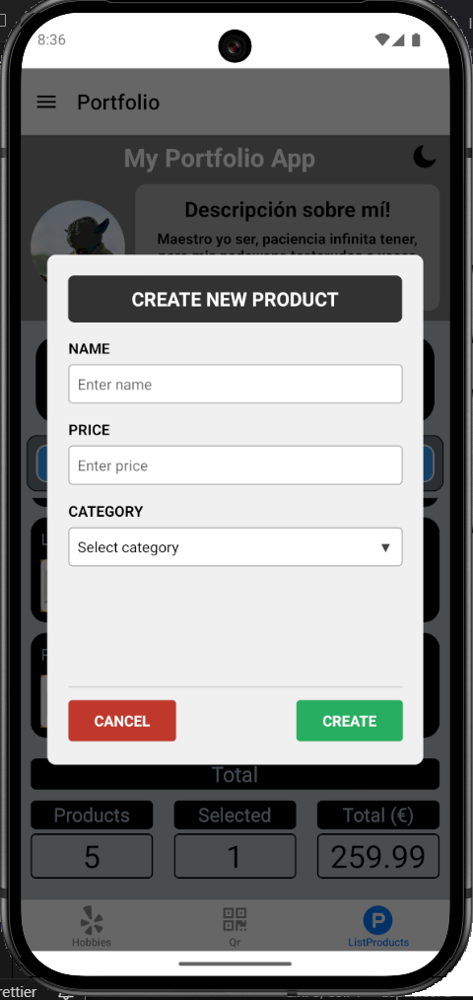
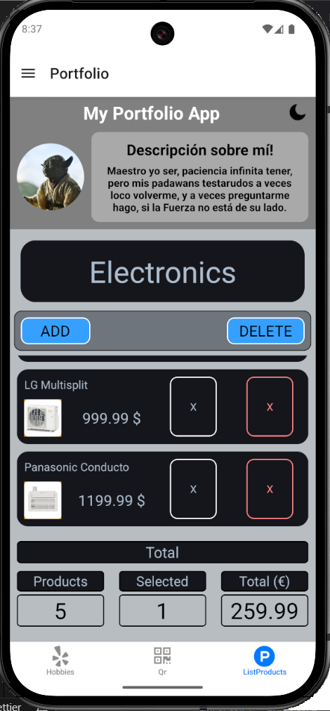

# Listado de Productos

Se ha añadido una nueva pagina para el **listado de productos**.

---

---

## Integración en la Navegación

- El Listado de productos fue agregado al **tab** principal, permitiendo acceso directo desde la barra inferior de navegacion.

---

## Funcionalidad del Listado

- El listado permite agregar productos.
- Al presionar un producto, se despliega un modal para ingresar sus detalles.

- Se pueden eliminar productos y el recuento total de productos se actualiza automaticamente.

---

[Volver al README](../README.md)
