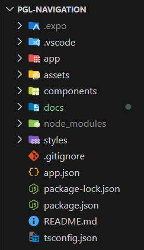
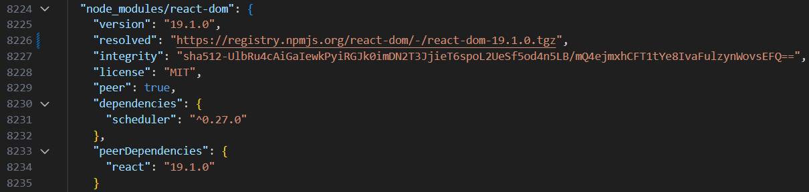

# Configuración del Proyecto

## Configuración Estructural

### Creación del Proyecto

Ejecuta el siguiente comando para crear el proyecto:

```
npx create-expo-app PGL-Navigation --template
```

Selecciona la opción:
**Blank Typescript**

Abre el proyecto en VSCode.

---

### Estructura del Proyecto

El proyecto tendrá una estructura como la siguiente:



---

### Instalación de Dependencias

Instala las siguientes dependencias:

```
npx expo install expo-router react-native-safe-area-context react-native-screens expo-linking expo-constants expo-status-bar
```

### Modificaciones en Archivos de Configuración

#### Cambiar punto de entrada en `package.json`

Esto permite que el archivo `_layout.tsx` sea el punto inicial de navegación:

```
{
"main": "expo-router/entry"
}
```

#### Configura el Scheme

El `scheme` permite usar deep linking y abrir la app desde enlaces externos personalizados, además de facilitar integraciones externas (autenticación, notificaciones, etc):

```
{
"scheme": "your-app-scheme"
}
```

#### (Opcional) Compatibilidad de Dependencias

Si tienes errores de compatibilidad al instalar dependencias, ajusta la versión de `react-router-dom` a la `19.1.0` en `package-lock.json`:



---

## Organización de Carpetas y Componentes

### app

- Carpeta principal con las páginas del proyecto.
- Contiene un archivo `_layout.tsx` para la estructura de navegación principal.

### porfolio

- Subcarpeta dentro de `app` para páginas/archivos del proyecto anterior.
- Su propio `_layout.tsx` define la navegación interna entre estas páginas.

### assets

- Carpeta para iconos e imágenes del proyecto.

### components

- Contiene **componentes reutilizables** y globales, no ligados a una sola página.
- **Diferencias:**
  - Los componentes en `app` son vistas/páginas completas.
  - Los de `components` son piezas de UI reutilizables (botones, headers, inputs, etc).

### docs

- Carpeta para documentación interna.
- Aquí irán imágenes solo usadas para documentar y archivos extra necesarios para explicar cada ejercicio.

### styles

- Archivos de estilos, divididos por cada componente del proyecto.

---

[Volver al README](../README.md)
