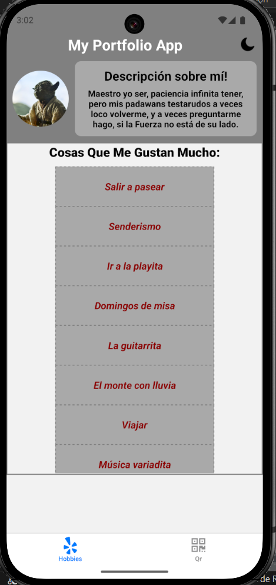
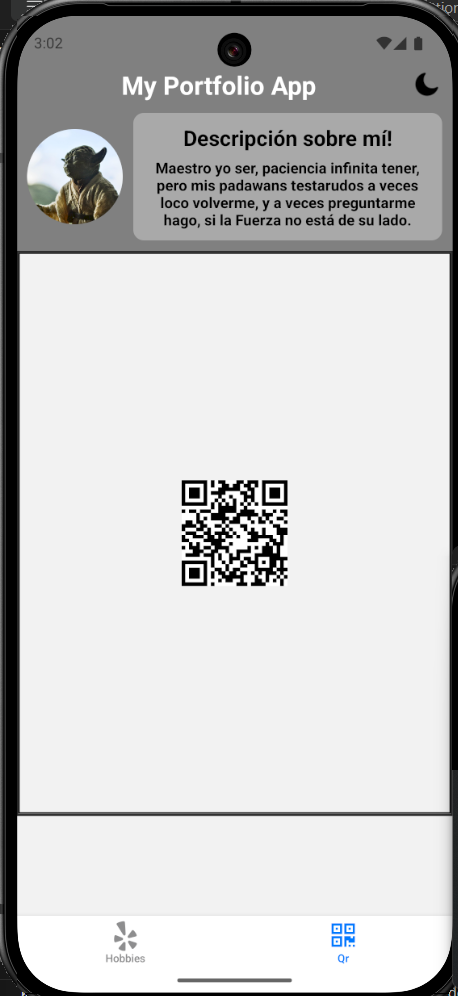
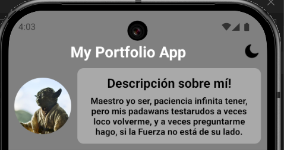
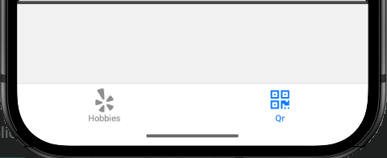

# Reciclaje y Navegación de Portfolio Anterior

## Reciclar Portfolio Anterior

Se reutilizó el portfolio previo integrando nuevas pantallas y componentes personalizados para hobby y QR.

- Pantalla de hobbies creada y configurada



- Pantalla de QR del repositorio creada y configurada



---

## Componente Cabecera

- Implementado un componente de cabecera (header) reutilizable para mantener la coherencia visual en todas las vistas principales.



---

## Navegación Entre Pantallas (Hobbies y QrImage)

- En el archivo `_layout.tsx` dentro de la carpeta `porfolio` se diseña la navegación principal, incorporando estructura semántica y tabs para cambiar entre las pantallas creadas.

```
<Header />
<Slot />
<Tabs>
    <Tabs.Screen name="Hobbies" />
    <Tabs.Screen name="QrImage" />
</Tabs>

```


